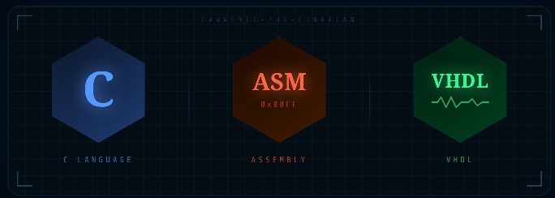

# Lawrence-The-Cinarian 👨🏾‍💻

Computer Engineering Student | Systems Programming Enthusiast | Future Infrastructure Architect  

## 🚀 About Me

I am a Computer Engineering student currently focused on mastering low-level systems development.

I am not just learning to code but also 
learning to understand how machines think.

My interests revolve around:

- Memory architecture  
- Data packet movement  
- CPU-level execution  
- Hardware–software interaction  
- Efficient system design  

I believe strong foundations create powerful systems.  
That is why I am currently focused on learning deeply before building massively.

## 🧠 Currently Learning

I am a polyglot coder in progress, sharpening my skills in:

- C (Systems Programming & Memory Management)
- Assembly Language
- VHDL (Hardware Description & Digital Design)

  

These are not easy languages, but I chose them intentionally.  
I am building the discipline required to engineer at the lowest level.

## 🛠️ Current Projects (Learning Phase)

- CLI Calculator (C)
- Unit Converter (C)
- Currency Converter (C)
- Atm Simulator (C)
- Crypto-Currency Converter (C)
  
These projects represent my foundational stage, focusing on control flow, structured programming, and compiler workflow.

More advanced systems projects coming soon.

## 🎯 Mission

To understand computing from transistor to network stack.

To design systems that move data faster, safer, and more efficiently.

To become a systems engineer capable of building infrastructure-level technology.

This is the beginning.

## 📚 Philosophy

Learn deeply.  
Build deliberately.  
Optimize relentlessly.  

Slow progress is still progress.

## 🔥 Quote I Live By

> "The machine does exactly what you tell it. Master the machine."

